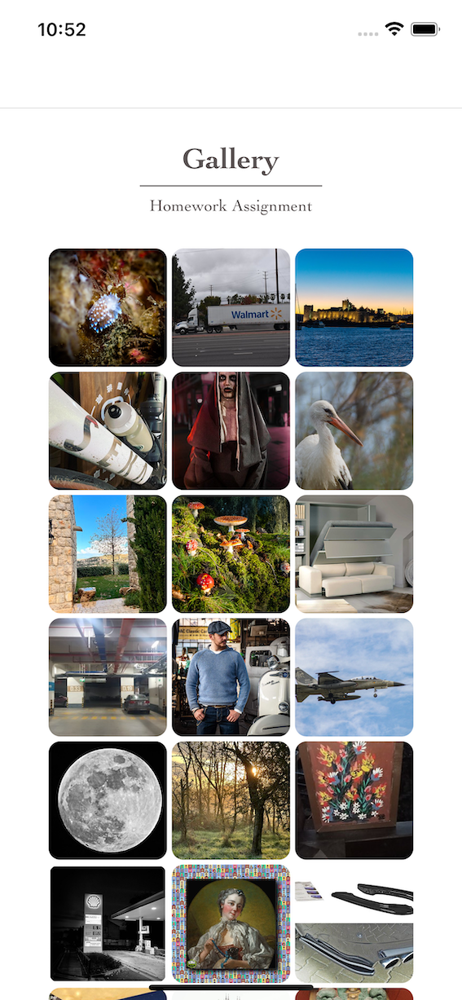
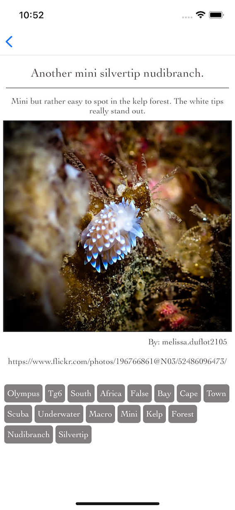
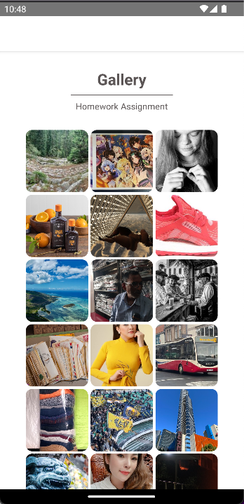
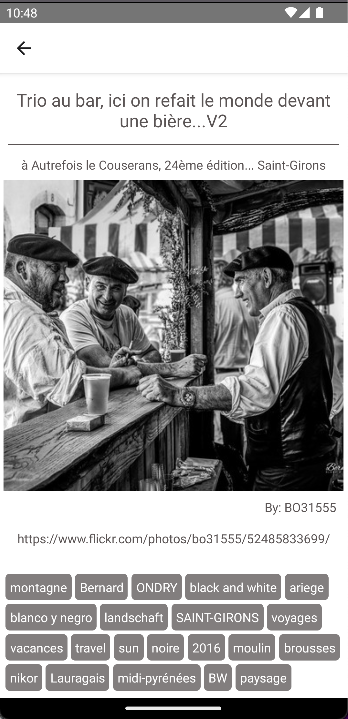

# GALLERY: Homework Assignment

## Description

React Native mobile application showcasing images from Flickr API.

iOS
<p float="left">
  
  
</p>  

Android
<p float="left">
  
  
</p>  

## Details

Created using **create-react-app** together with **typescript** template.

Used libraries:
* React Navigation
* react-native-dotenv

## Running the project

**API_KEY= stored in .env**

- In project's root folder and run
```
npm install
```
- For iOS user: go to /ios folder and install pods
```
pod install
```
- Run application
```
npm run ios
```
or
```
npm run android
```